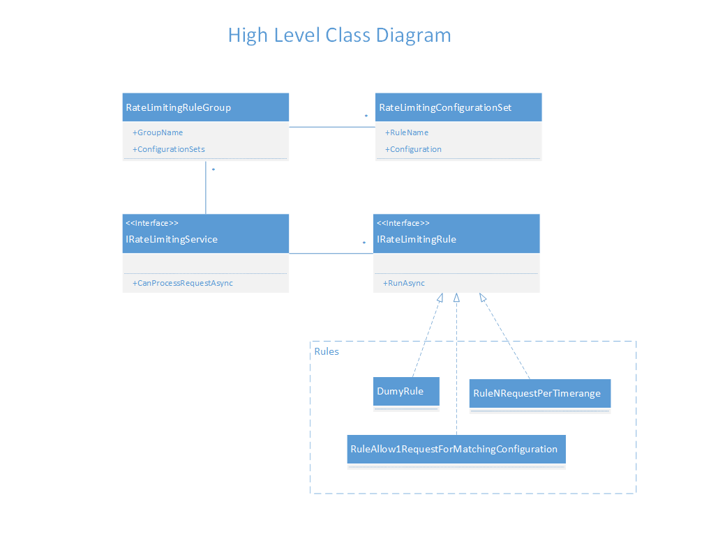

# Description
From the original description below, the main objective of this exercise is to evaluate the design for a solution to this problem. 
Based on this, I designed a simple solution with a service that runs a group of configured rules per each endpoint. 
Each rule is independent of each other and can verify anything that is required. Rules can be reusable or built for specific scenarios.

## Requirements
- The system shall be capable of applying different rate-limiting rules to each endpoint.
- The system shall be able to reuse any given rule.
- The system shall be able to add as many rules as needed.
- The rules should be configurable.

## Design

<ins>**Components**</ins>

**Service**  - This is the main component and is responsible for running the rules for a given endpoint.

**Rule** - Here is where the magic happens. Each rule is independent from the others and can verify any scenario. Ex: X request per Y time, country C can have a maximum of X requests, etc.
Because the rules are independent they can have different dependencies and states from each other. 

<ins>Rules are the extension point in this design</ins>. If we need to verify something different we can add a new rule that matches our needs. 

**Rule Group** - <ins>This is where the system is configured</ins>, here we can group a set of rules and their configuration to a group name 
that later can be referenced from endpoints. I also added an option for a "global" group that will apply to all endpoints.
<ins>A single rule can be used in multiple groups and each one can have a different configuration</ins>.

<ins>**Assumptions & Technical Decisions**</ins>
- Based on the original problem description I wouldn't expect that a single endpoint use a different set of rules on each environment (dev, qa, etc). 
This was the main driver to have the configuration in the code. If this is not the case, the configuration can be easily moved to a JSON file.
- A few sample dummy rules were created to show how different the rules can be from each other and that they are independent. 
- As mentioned in the instructions, I kept the state in memory, and no libraries were added to support a more complex solution.
- A dummy country provider was added as a sample. The objective is to have a component that maps an IP to a country,  so a rule can run for
a given country. The current configuration supports only one country, but this can easily be improved to support a list.
- I didn't include "client token" as it was discussed in Github/Issues that the rules apply to all clients for that same endpoint. If this must be updated, it will be an easy change. As you can see, in the ActionFilter there is a section with a comment indicating where this can be extracted from the request and passed on to all the rules for their evaluation.
- No tests were provided for RateLimiterWeb as this is only a configuration and usage sample.

## Code Organization
**RateLimiter** - The main project holding the service, rules, and supporting components.

**RateLimiter.Tests** - Project holding tests for RateLimiter.

**RateLimiterWeb** - Project showing a sample of the service configuration and usage. Relevant files: Program (configuration), Controller (usage), folder "RateLimiting" (classes that make the approach work) 

## What's next?
- Better error handling, this code shows only basic error handling
- Better logging, this code only logs to the console log
- Create actual rules, this code only has a sample of rules for some scenarios. 
- Use real repositories (cache, or similar)
- Add priority to the rules, the current approach just runs them in parallel, but we may need to add priority and run them by tiers. Ex. "Allow all requests from a given client for a given endpoint". This rule would need to run and short-circuit the process preventing other rules from running.

# Original Description

**Rate-limiting pattern**

Rate limiting involves restricting the number of requests that a client can make.
A client is identified with an access token, which is used for every request to a resource.
To prevent abuse of the server, APIs enforce rate-limiting techniques.
The rate-limiting application can decide whether to allow the request based on the client.
The client makes an API call to a particular resource; the server checks whether the request for this client is within the limit.
If the request is within the limit, then the request goes through.
Otherwise, the API call is restricted.

Some examples of request-limiting rules (you could imagine any others)
* X requests per timespan;
* a certain timespan has passed since the last call;
* For US-based tokens, we use X requests per timespan; for EU-based tokens, a certain timespan has passed since the last call.

The goal is to design a class(-es) that manages each API resource's rate limits by a set of provided *configurable and extendable* rules. For example, for one resource, you could configure the limiter to use Rule A; for another one - Rule B; for a third one - both A + B, etc. Any combination of rules should be possible; keep this fact in mind when designing the classes.

We're more interested in the design itself than in some intelligent and tricky rate-limiting algorithm. There is no need to use a database (in-memory storage is fine) or any web framework. Do not waste time on preparing complex environment, reusable class library covered by a set of tests is more than enough.

There is a Test Project set up for you to use. However, you are welcome to create your own test project and use whatever test runner you like.   

You are welcome to ask any questions regarding the requirements—treat us as product owners, analysts, or whoever knows the business.
If you have any questions or concerns, please submit them as a [GitHub issue](https://github.com/crexi-dev/rate-limiter/issues).

You should [fork](https://help.github.com/en/github/getting-started-with-github/fork-a-repo) the project and [create a pull request](https://help.github.com/en/github/collaborating-with-issues-and-pull-requests/creating-a-pull-request-from-a-fork) named as `FirstName LastName` once you are finished.

Good luck!
