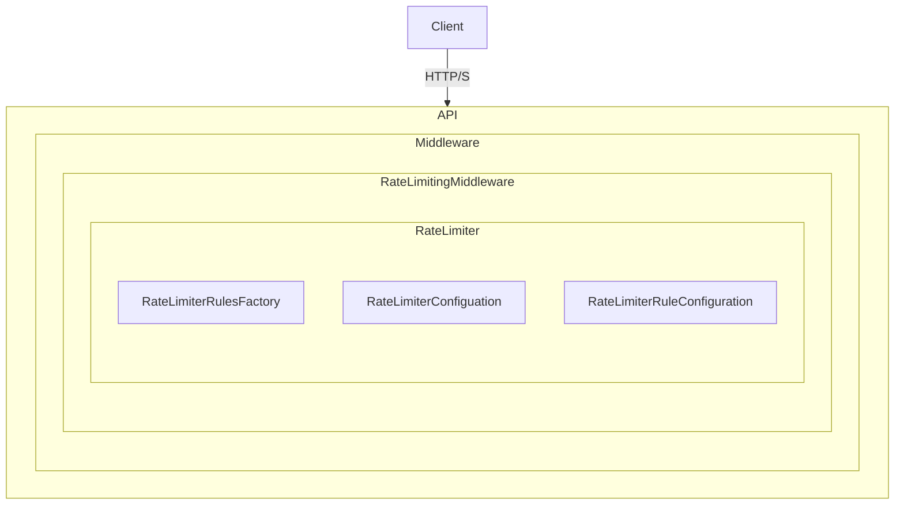

# RateLimiter
A class library for providing [configurable](#configuration-anchor-point) and [extensible](#extensibility-anchor-point) rate limiting for web applications.
***
## Approach
With my understanding of the instructions, I felt that my job was to design a _framework_ for rate limiting ... something that you would pull down from NuGet and integrate within your own API to facilitate rate limiting.  That is what I am providing.

I started with a top-down approach.  That is to say, I started with the question of: "If I was going to be the consumer, how would I want to be able to use it?"  I started at the controller level, desgined my [attributes](https://github.com/jrandallsexton/rate-limiter/blob/master/RateLimiter/Config/RateLimitedResource.cs), how I'd like to configure my [rules](https://github.com/jrandallsexton/rate-limiter/tree/master/RateLimiter/Rules), and went from there.

I cannot say at this time whether or not this approached worked better than going bottom-up.  I will say, however, that I feel implementation details have leaked - but then again, what's the saying?  Something like "all abstractions are leaky"?
***
## Decisions/Assumptions
Per the instructions, most of the time was spent around designing the rate limiting framework itself with much less concern about the implementation details for each of the four algorithms.  As a matter of fact, the algorithms for 4 of the 5 implementations were "lifted" directly from the internet.

In addition to a lack of unit tests on the implementation algorithms, no time was spent running benchmarks in attempts to tweak performance and minimize memory usage.  In a real-world scenario, this is basically a placeholder for another team member to research, implement, test, benchmark, and adjust.
***
## Registration, Configuration & Usage
Details below:
***
### Service Registration
Registration of _RateLimiter's_ required services is provided via a fluent api exposed by [RateLimiterRegister](https://github.com/jrandallsexton/rate-limiter/blob/master/RateLimiter/DependencyInjection/RateLimiterRegister.cs).

Example:
```
builder.Services.AddRateLimiting()
    .WithConfiguration<RateLimiterConfiguration>(builder.Configuration.GetSection("RateLimiter"));
```
***
### Configuration
<a name="configuration-anchor-point"></a>
_RateLimiter_ can be configured via a standard appSettings.json section (or other configuration provider, i.e. Azure App Config) or via use of a fluent api.

#### AppSettings.json Configuration
Configuration spec:
<a name="json-config-anchor-point"></a>
```
"RateLimiter": {
  "DefaultAlgorithm": "FixedWindow|LeakyBucket|SlidingWindow|TokenBucket",
  "DefaultMaxRequests": <int>,
  "DefaultTimespanMilliseconds": <int>,
  "Rules": [
	{
	  "Name": "MyDistinctRuleName",
	  "Type": "RequestPerTimespan|TimespanElapsed",
	  "Discriminator": "Custom|GeoLocation|IpAddress|IpSubnet|QueryString|RequestHeader",
	  "DiscriminatorMatch": "*"|<string?>|<string>",
	  "DiscriminatorCustomType": <string?>,
	  "MaxRequests": <int?>,
	  "TimespanMilliseconds": <int?>,
	  "Algorithm": "Default|FixedWindow|LeakyBucket|SlidingWindow|TokenBucket|TimespanElapsed"
	}
  ]
}
```
#### FluentApi Configuration
~~TBD~~ (will not be implemented at this time; please use json-based configuration)

***
### Usage in Controller-Based Applications
Registration of a rate limiting rule (or multiple rules) requires an attribute with a single parameter - the distinct name of the rule configured within the RateLimiter.Rules section.

The attribute is valid at either the controller or endpoint (method) level.

Example usage - Controller/Class Level
```
[RateLimitedResource(RuleName = "RequestsPerTimespan-Default")]
[ApiController]
[Route("[controller]")]
public class WeatherForecastController : ControllerBase {
	// class implementation
}
```

Example usage - Endpoint/Method Level:

```
[RateLimitedResource(RuleName="MyFirstDistinctRuleName")]
[RateLimitedResource(RuleName="MySecondDistinctRuleName")]
[HttpGet(Name="GetWeatherForecast")]
public IEnumerable<WeatherForecast> Get() {
  // method implementation
}
```
***
### Usage in MinimalApi-Based Application
***_Not Yet Implemented_***

Registration of a rate limiting rule (or multiple rules) requires usage of the FluentApi with a single parameter - the distinct name of the rule configured within the RateLimiter.Rules section.

Example usage:
```
app.MapGet("/weatherforecast", () =>
{
   // method implementation
})
.WithName("GetWeatherForecast")
.WithRateLimitingRule("MyFirstDistinctRuleName")
.WithRateLimitingRule("MySecondDistinctRuleName");
```
***
## Internal Class Hierarchy & Components
| Class | Hierarchy | Purpose |
| ----------- | ----------- |
| [RateLimiterRegister](https://github.com/jrandallsexton/rate-limiter/blob/master/RateLimiter/DependencyInjection/RateLimiterRegister.cs) | | Static class with extension methods for DI registration for consumer's convenience
| | [RateLimiterConfiguration](https://github.com/jrandallsexton/rate-limiter/blob/master/RateLimiter/Config/RateLimiterConfiguration.cs) | Used by RateLimitRegister to deserialize the rate limiting configuration from JSON.
| [RateLimitedResource](https://github.com/jrandallsexton/rate-limiter/blob/master/RateLimiter/Config/RateLimitedResource.cs) | |Attribute for specifying that a resource should be rate limited. Supports both class and method locations.
| [RateLimiterMiddleware](https://github.com/jrandallsexton/rate-limiter/blob/master/RateLimiter/Middleware/RateLimiterMiddleware.cs) | |Middleware for processing RateLimitedResource attributes and passing the HttpContext to RateLimiter.
| [RateLimiter](https://github.com/jrandallsexton/rate-limiter/blob/master/RateLimiter/RateLimiter.cs) | | Primary class resposible for processing incoming requests, obtaining discriminator values, determining matches, and processing via provided algorithms.
| | [RateLimiterRulesFactory](https://github.com/jrandallsexton/rate-limiter/blob/master/RateLimiter/RateLimiterRulesFactory.cs) | Used by RateLimiter at start-up to load all rules as configured by the consuming assembly
| | [DiscriminatorProvider](https://github.com/jrandallsexton/rate-limiter/blob/master/RateLimiter/Discriminators/DiscriminatorProvider.cs) | Used by RateLimiter at start-up to load all discriminators (native and custom)
| | [AlgorithmProvider](https://github.com/jrandallsexton/rate-limiter/blob/master/RateLimiter/Rules/Algorithms/AlgorithmProvider.cs) | Used by RateLimiter at start-up to load all algorithms as required within the configuration of the consuming assembly
***

***
## Pseudocode
### RateLimiter.IsRequestAllowed()
1. Get applicable rules from complete rules collection (pre-loaded)
2. Get the discriminators for each applicable rule
3. Invoke the discriminator for each and evaluate _IsMatch_
4. Trim the current rules collection to those whose discriminator matched their respective condition (if present)
5. Process each rule usig the matching logo (pre-loaded)
6. Return the result
***
## Extensibility
<a name="extensibility-anchor-point"></a>
Consumers can add their own custom discriminators for more complex scenarios.  The process of doing so consists of 3 parts:

1. Provide a class that implements _IProvideADiscriminator_. (Example in RateLimiter.Tests.Api [GeoTokenDiscriminator](https://github.com/jrandallsexton/rate-limiter/blob/master/RateLimiter.Tests.Api/Middleware/RateLimiting/GeoTokenDiscriminator.cs))
2. Create a rule in your [json-based configuration](#json-config-anchor-point) that specifies that class name in the _DiscriminatorCustomType_ property on a _Rules_ entry.
3. Modify the service registration to include your custom discriminator as shown below

```
builder.Services.AddRateLimiting()
    .WithCustomDiscriminator<MyCustomDiscriminator>()
    .WithConfiguration<RateLimiterConfiguration>(builder.Configuration.GetSection("RateLimiter"));
```

Multiple custom discriminators can be added provided they each have a unique name.  A run-time exception will be thrown immediately upon application start in the case of a duplicated name.

_The example for this is the sole purpose of RateLimiter.Tests.Api - which is not a test assembly, per-se - but I needed to have a place for a client in order to demonstrate consumption and usage.__